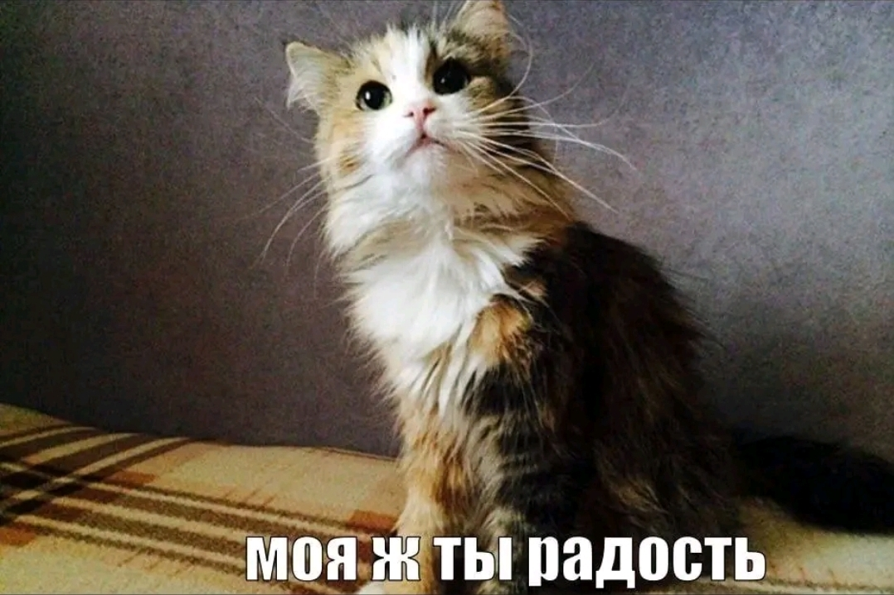

## ***Я снова слышу музыку...***

здесь будут some kind of мини-проекты или просто работы по ряду дисциплин.
*не умна да и идеи сомнительные, но кто знает...*

- студентка *РГПУ им. А. И. Герцена*, группа *2об_ИИТО/24*
- *куратор* 1 курса ИИТО
- Python, C++, HTML, CSS
- **😴****😴****😴**

### *connect me?*
- *[tg](https://t.me/lenivinya)*
- *[vk](https://vk.ru/ariyanoto)*
- *[discord](https://discordapp.com/users/1312197954542501992)*
- *[ya.music](https://music.yandex.ru/playlists/lk.9ef8fe42-f29a-4573-8578-545d633798ce?utm_source=desktop&utm_medium=copy_link)*

#
<h1 align="center"></h1>
